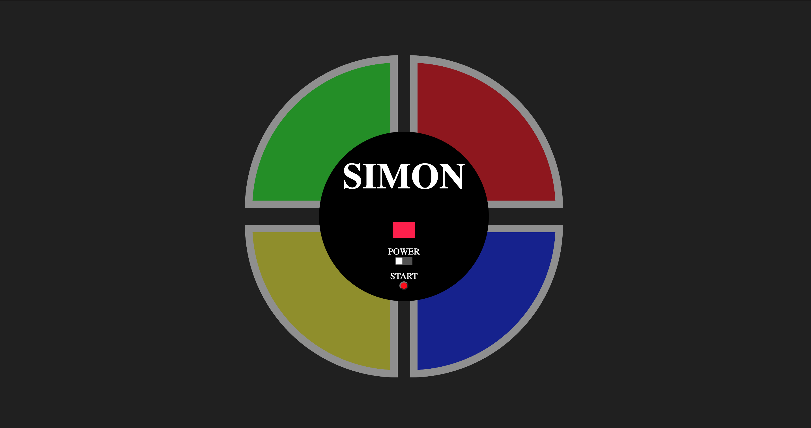

# Simon

## About

My spin on the classic memory game we all grew up playing. WARNING: Equally as frustrating...

---

## ScreenShots 

---

## Tech Used

-HTML

-CSS

-Vanilla Javascript

The app utilizes the DOM API and the Model, View, Controller design pattern. 

---

## Getting Started

Upon powering on and clicking "Start":

The game will display a color for the player to repeat and with each level a new color is added until the player fails to repeat the pattern successfully.

[Play Simon](https://codymurr.github.io/Simon/)

---

## Next Steps

-Add logic for player win

-Add attempts feature that allows the player a certain number of failed attempts before losing the game

-Add "strict" mode to only allow for one failed attempt